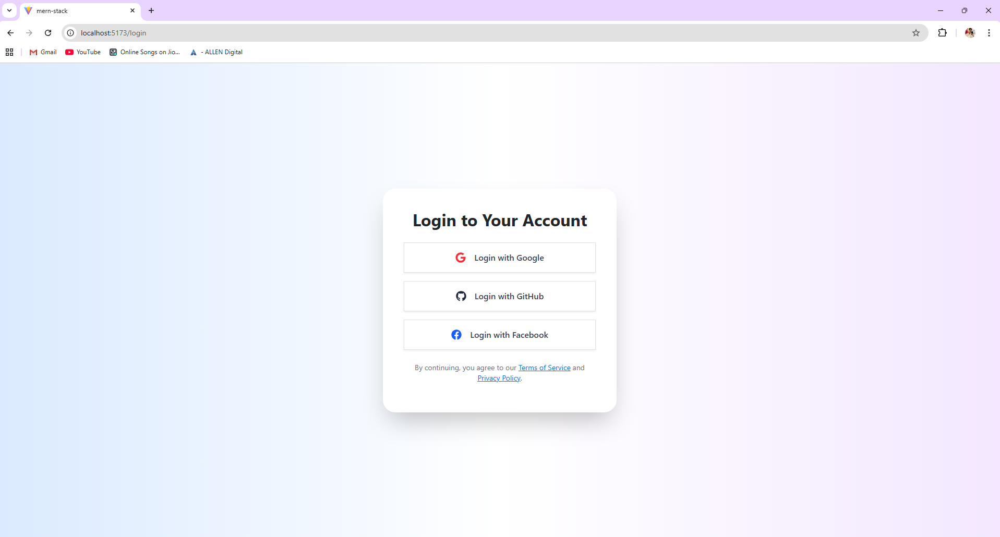
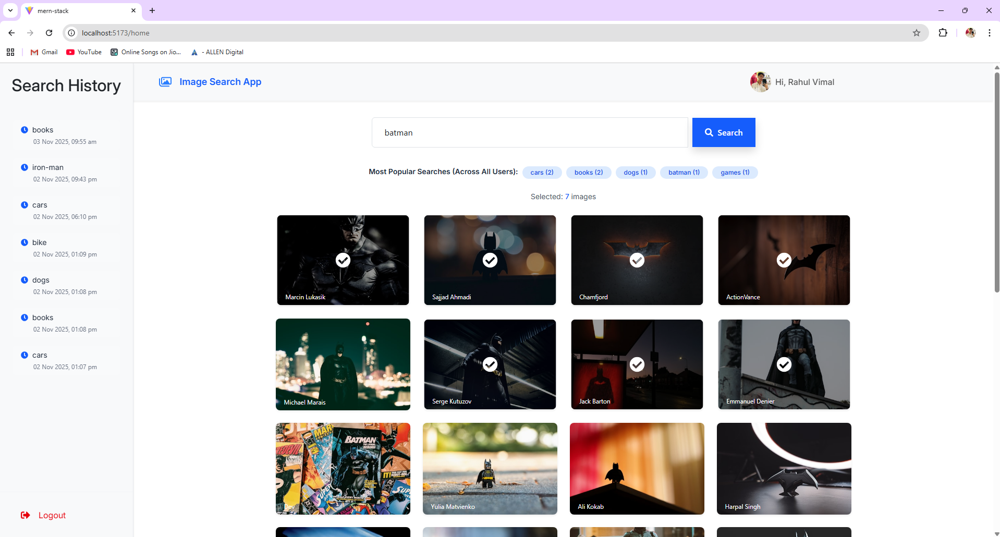

# 🖼️ Image Search App (MERN + OAuth)

A full-stack image search application built using **MERN Stack (MongoDB, Express, React, Node)** with **OAuth authentication** (Google, GitHub, Facebook).  
Users can search images from the **Unsplash API**, view top searches across all users, and manage their personal search history.

## Important Note:
Facebook OAuth integration is not fully configured in this project because my Facebook Developer account is currently under verification, and I haven’t received access to the App ID and Secret yet.

## Project Screenshots

### OAuth Login

### Top Searches Banner

### Search Results + Multi-Select

### User Search History

## Folder Structure

image-search-app/
│
├── client-side/                     # React frontend
│   ├── src/                         # React components, hooks, and pages
│   │   ├── components/              # Reusable UI components (Button.jsx, Navigation.jsx, Search.jsx, Sidebar.jsx)
│   │   ├── pages/                   # Page components (Login.jsx, Home.jsx, AccessToken.jsx)
│   │   ├── App.css                  # Main CSS file
│   │   ├── index.css                # Global styles
│   │   ├── App.js                   # Main React app entry
│   │   └── index.js                 # ReactDOM entry point
│   ├── public/                      # Static assets (favicon, index.html, etc.)
│   └── package.json                 # Frontend dependencies
│
├── server-side/                     # Node + Express backend
│   ├── routes/                      # Express route files (authRoute.js, searchRoute.js)
│   ├── models/                      # Mongoose schema files (userModel.js, searchModel.js)
│   ├── config/                      # Passport.js configuration
│   ├── database/                    # MongoDB connection file (db.js)
│   ├── middleware/                  # Authentication middleware (isMiddleware.js)
│   ├── controllers/                 # Controller files (searchController.js, userController.js)
│   ├── index.js                     # Main server entry file
│   ├── package.json                 # Backend dependencies
│   └── .env.example                 # Example environment variable file
│
├── screenshot/                      # Screenshots & demo images for README
│   ├── login.png
│   ├── home.png
│   ├── searche.png
│   ├── select.png
│   ├── history.png
│   └── image.png
├── README.md                        # Project documentation

## Environment Variables Setup

PORT=8000
MONGODB_SERVER=your_mongodb_connection_string
UNSPLASH_ACCESS_KEY=your_unsplash_api_key
GOOGLE_CLIENT_ID=your_google_client_id
GOOGLE_CLIENT_SECRET=your_google_client_secret
GITHUB_CLIENT_ID=your_github_client_id
GITHUB_CLIENT_SECRET=your_github_client_secret
CLIENT_URL=http://localhost:5173
SECRET_KEY="api1234"

# Facebook OAuth (pending account verification)
FACEBOOK_APP_ID=your_facebook_app_id   # Pending
FACEBOOK_APP_SECRET=your_facebook_app_secret   # Pending

## Features

**OAuth Authentication**
- Login using Google, GitHub, or Facebook (via Passport.js).  
- Only logged-in users can access the app.

**Image Search**
- Fetches high-quality images from the **Unsplash API**.
- Displays search results in a 4-column responsive grid.
- Shows “You searched for X – N results” message.

**Multi-Select Functionality**
- Users can select multiple images with checkboxes.
- Dynamic counter shows the number of selected images.

**Top Searches**
- Displays the top 5 most searched terms across all users.

**User Search History**
- Shows logged-in user’s previous searches with timestamps.

##  Tech Stack

| Layer | Technology |
|-------|-------------|
| Client | React.js, Axios, React Router |
| Server | Node.js, Express.js |
| Database | MongoDB (Mongoose) |
| Authentication | Passport.js (Google, GitHub, Facebook OAuth) |
| API | Unsplash API |

## Postman Collection 

-POST /api/search---
Request Body:
{
  "term": "nature"
}
Response Example:
{
  "results": [
    { "id": "abc123", "term": "nature", "userId":"xyz" },
    { "id": "xyz456", "term": "batman", "userId":"xyz" }
  ]
}

-cURL Example:
curl -X POST http://localhost:8000/api/search \
-H "Content-Type: application/json" \
-d '{"term": "mountains"}'

-GET /api/top-searche
Response Example:
{
  "topSearches": [
    { "term": "nature", "count": 12 },
    { "term": "cars", "count": 8 }
  ]
}

cURL Example:
curl http://localhost:8000/api/top-searches

-GET /api/history
Response Example:

{
  "history": [
    { "term": "ocean", "timestamp": "2025-11-03T07:00:00Z" },
    { "term": "forest", "timestamp": "2025-11-02T12:00:00Z" }
  ]
}

cURL Example:
curl http://localhost:8000/api/history

-GET /api/images

{
results:[
    images for Unsplash API
    ]
}

cURL Example:
curl http://localhost:8000/api/images

